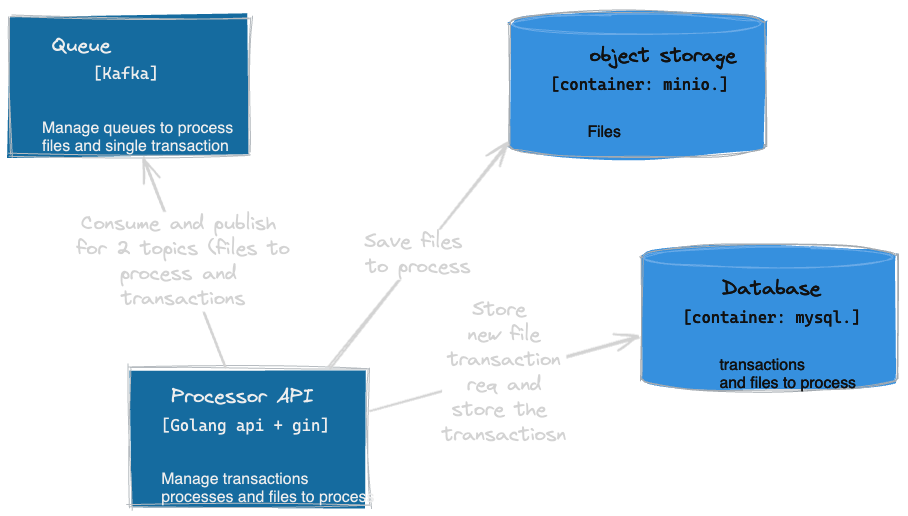

La idea es armar el procesamiento de los archivos por topico, de esta forma se podran
procesar en paralelo las transacciones de bulk y mantener estado y retry de las mismas

El archivo sera guardado para poder procesarlo luego (ya que si es muy pesado y queremos usar esto en un ui o llamar a otra api damos response rapido y comenzamos a procesar)

Para procesar los archivos el topico lo hace de forma transaccional, lo que si falla algun punto del procesamiento no envia los
mensajes a kafka

Luego por cada mensaje lo inserta y actualiza de forma transaccional la cantidad procesada por el evento y lo inserta.

Tenemos 2 topics:

* Topico de files
* Topico de eventos

Algunas mejoras pendientes son:

[ ] Agregar una retry-queue en el procesamiento de eventos

[ ] Agregar una dlq para los eventos que no se pudieron procesar

[ ] Mejorar el notificador de estados (ahora es un job interno, deberia ser algo externo y ser un cronjob)

[ ] Separar en servicios mas chicos cada componente.

[ ] Transaccionar la update del status con el envio del mensaje terminado a la queue de kafka

[ ] Agregar mas partitions y brokers de kafka si queremos escalar esto